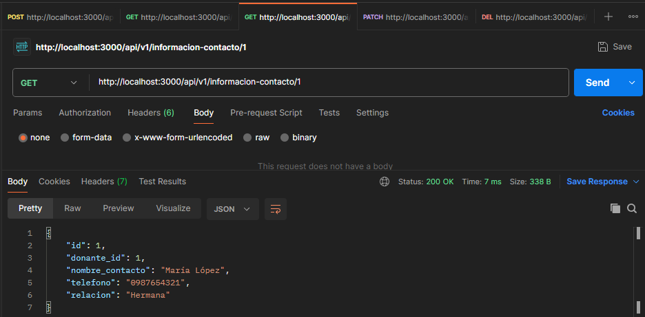
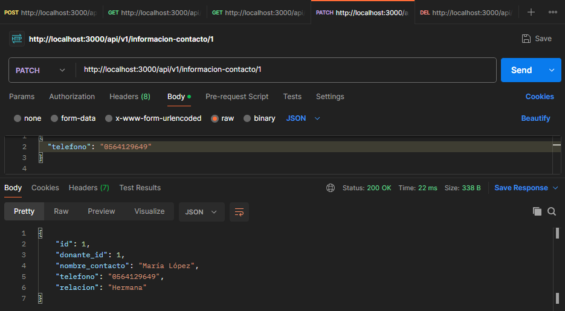

##Para la correcta instalacion de dependencias usamos lo siguiente:
## Project setup

```bash
$ npm install
$ npm i -g @nestjs/cli
$ npm install @nestjs/typeorm typeorm sqlite3
```

## Para copilar o levanatar el proyecto usamos lo siguiente:

```bash
# development
$ npm run start

# watch mode
$ npm run start:dev
```

## Para generar los recursos usamos el siguiente comando:
```bash
$ nest generate resource donante
$ nest generate resource historial-colaboracion
$ nest generate resource informacion-contacto
```

## Servicio ejecutado


## Pruebas de los endpoints

## DONANTE
1. POST DONANTE

2. GET DONANTE

3. GET ID DONANTE

4. PATCH DONANTE

5. DELETE DONANTE


## VERIFICACION DONANTE
1. POST VERIFICACION DONANTE

2. GET VERIFICACION DONANTE

3. GET ID VERIFICACION DONANTE

4. PATCH VERIFICACION DONANTE

5. DELETE VERIFICACION DONANTE


## INFORMACION CONTACTO
1. POST INFORMACION CONTACTO

2. GET INFORMACION CONTACTO

3. GET ID INFORMACION CONTACTO

4. PATCH INFORMACION CONTACTO

5. DELETE INFORMACION CONTACTO
