## Descipcion del proyecto
El proyecto consiste en la creación de un sistema de gestión de adopcion para mascotas, en mi caso implemente el modulo donante y mis entidades son : Donante, Verificacion Donante e Informacion Contacto

## Instrucciones para clonar, 
$ git clone https://github.com/joancema/ASW-2025-1 

## instalar dependencias 
$ npm install
$ npm i -g @nestjs/cli
$ npm install @nestjs/typeorm typeorm sqlite3 
$ npm install @nestjs/graphql @nestjs/apollo apollo-server-express graphql
$ npm install class-validator class-transformer

## jecutar el proyecto.
$ npm run start:dev

## Pruebas en graphql: http://localhost:3000/graphql
## DONANTE 
1. Crear un Donante (mutation)
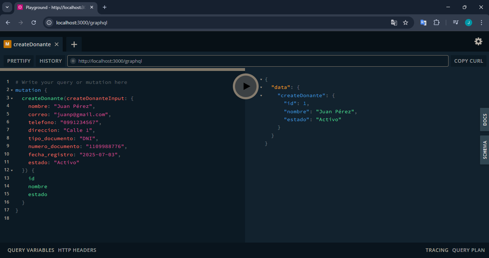
2. Consultar todos los Donantes (query)
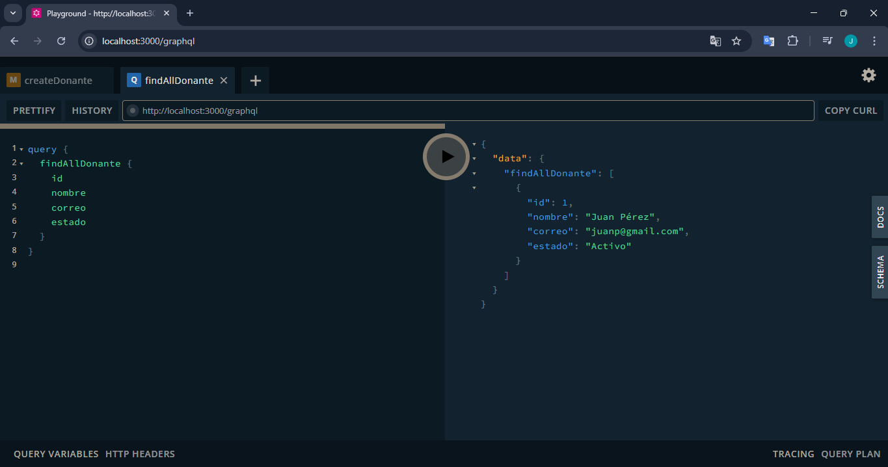
3. Consultar un Donante por id (query)
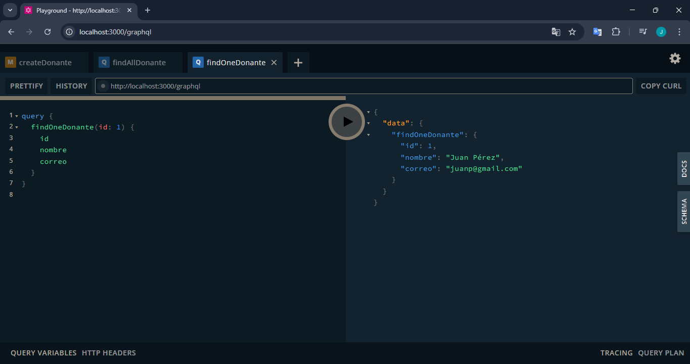
4. Actualizar un Donante (mutation)
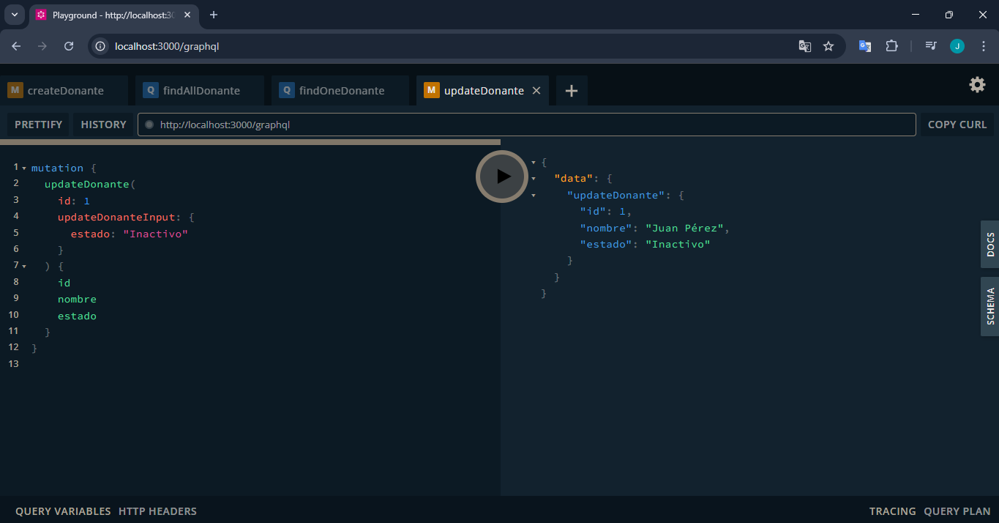
5. Eliminar un Donante (mutation)
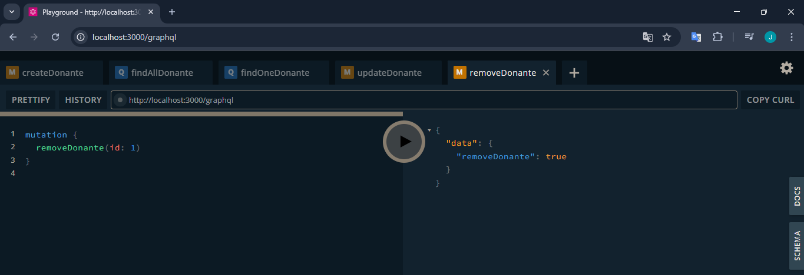

## INFORMACION CONTACTO
1. Crear una Informacion Contacto (mutation)
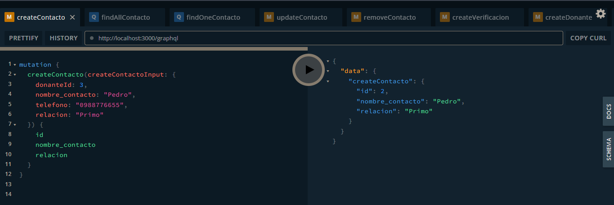
2. Consultar todas las Informacion Contacto (query)
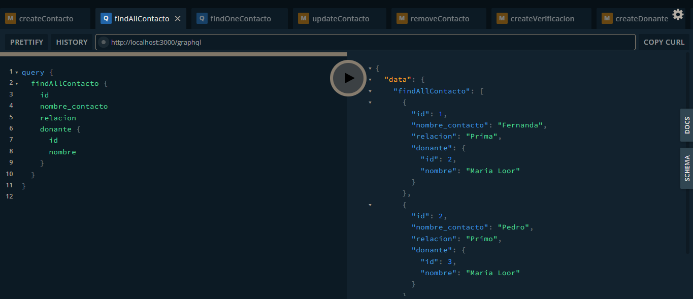
3. Consultar una Informacion Contacto por id (query)
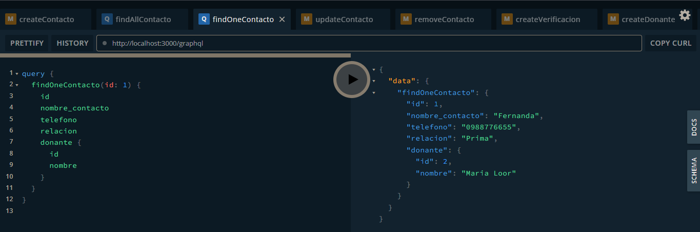
4. Actualizar la Informacion del Contacto (mutation)
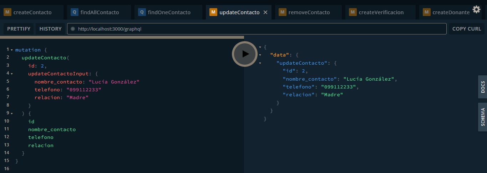
5. Eliminar una Informacion Contacto (mutation)
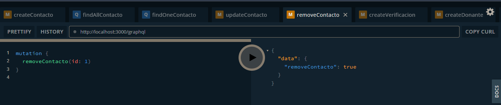

## VERIFICACION DONANTE
1. Crear una Verificacion Donante (mutation)
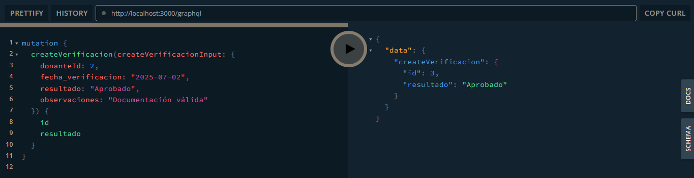
2. Actualizar la Verificacion de Donante (mutation)
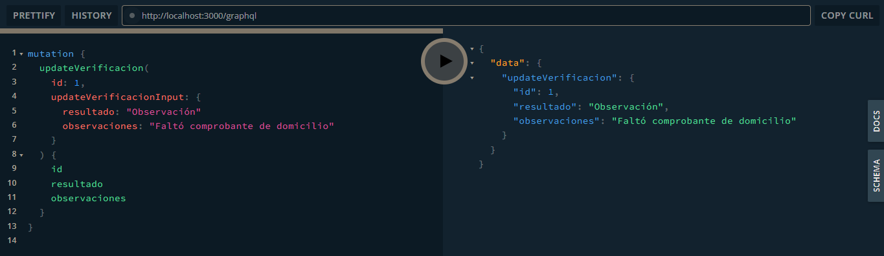
3. Elimar una Verificacion de Donante (mutation)
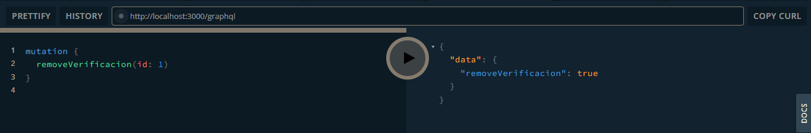
4. Consultar Verificacion por id (query)
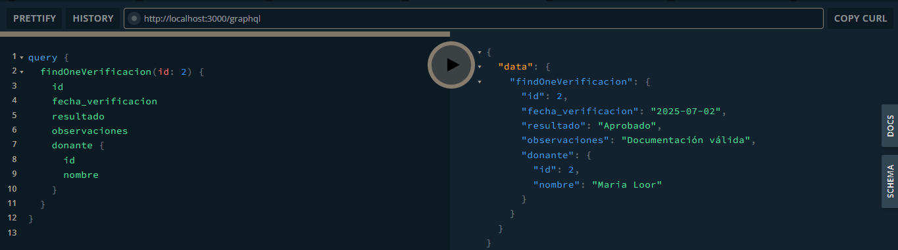
5. Consulta general de Verificaciones (query)
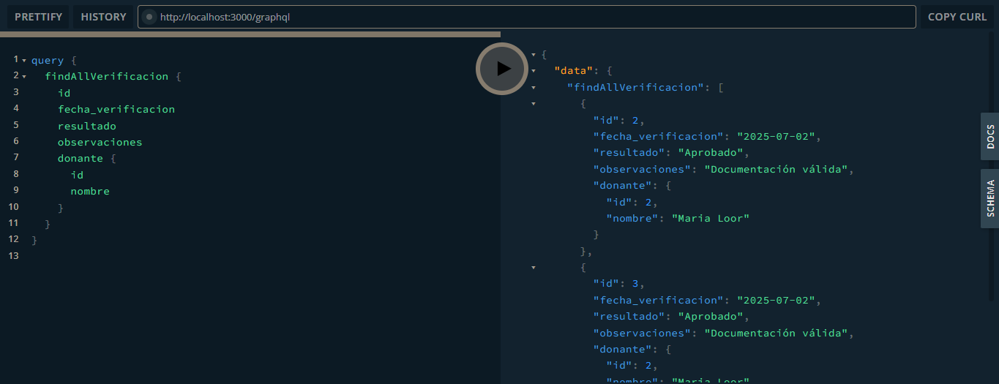