## Instalar dependencias WebSocket + TypeORM + SQLite
npm i @nestjs/websockets @nestjs/platform-socket.io socket.io \ @nestjs/typeorm typeorm sqlite3 @nestjs/mapped-types

## Entidades aplicadas 
Donate, Informacion Contacto, Verificacion Donante

## Pruebas en Postman
Donante:
1. Crear un nuevo donante
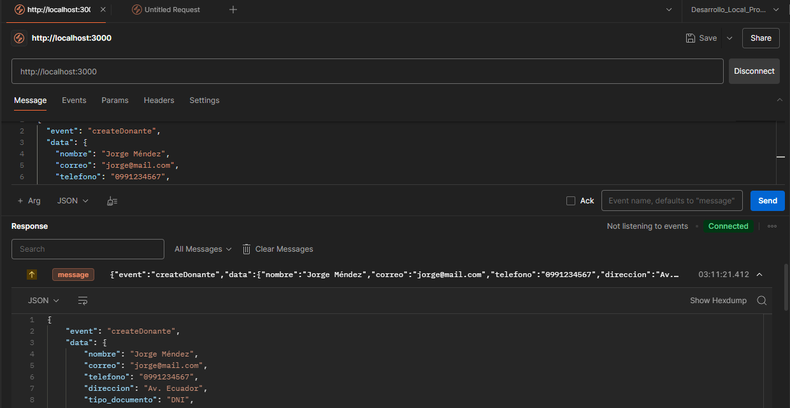
2. Verificar si el donante existe
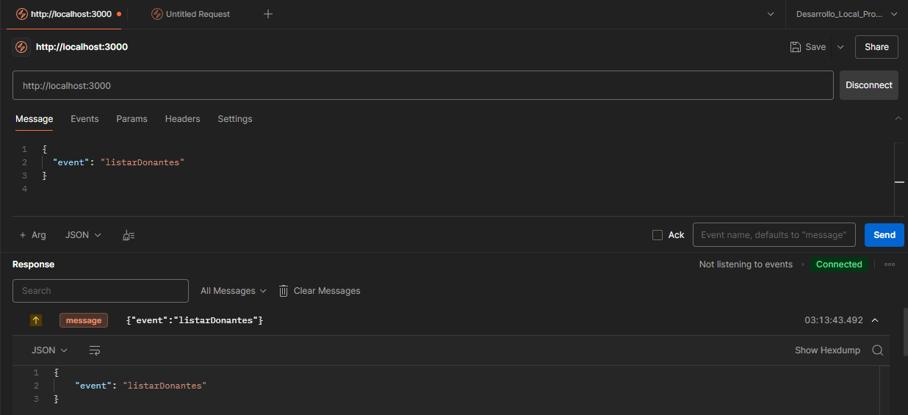
3. Actualizar datos del donante
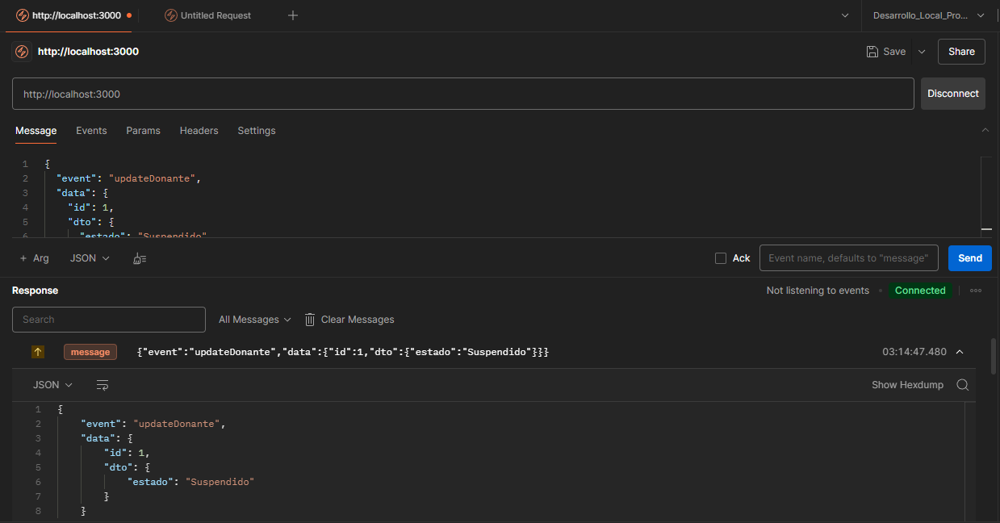
4. Eliminar donante
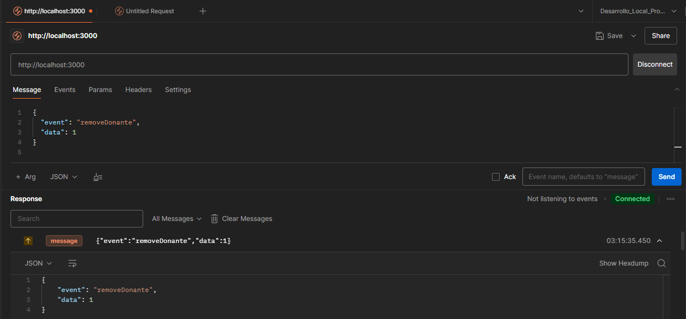

Verificacion Donante:
1. Crear una nueva verificacion
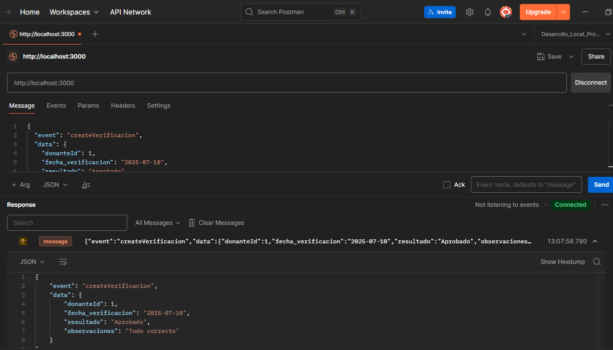 
2. Verificar si la verificacion existe
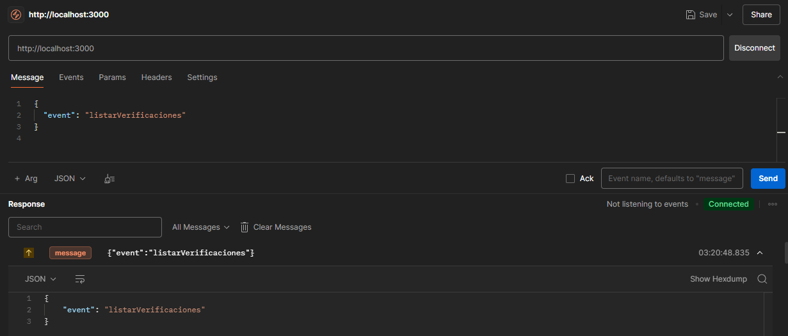
3. Actualizar datos de la verificacion
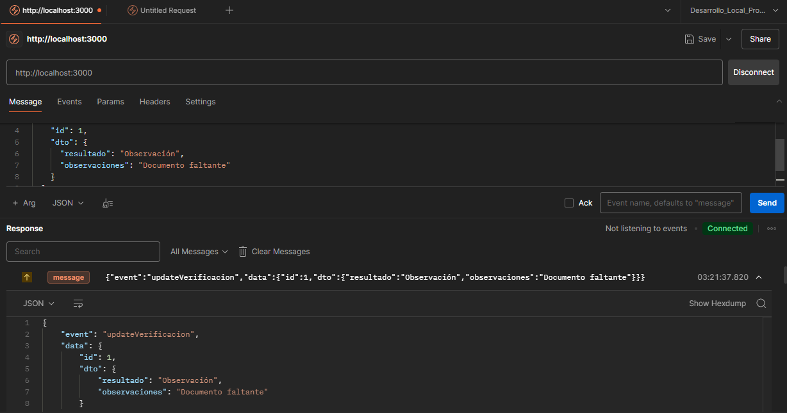
4. Eliminar verificacion
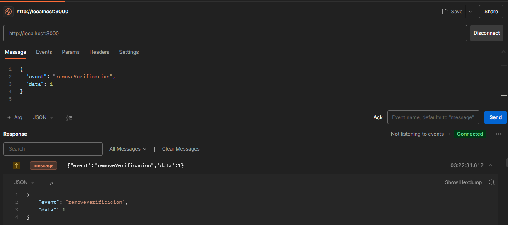

Informacion Contacto:
1. Crear un nuevo contacto
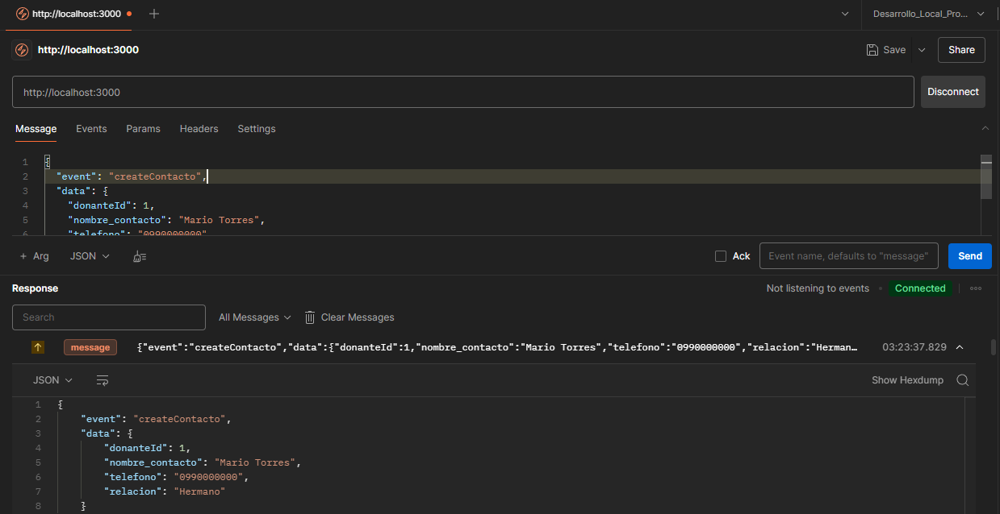
2. Verificar si el contacto existe
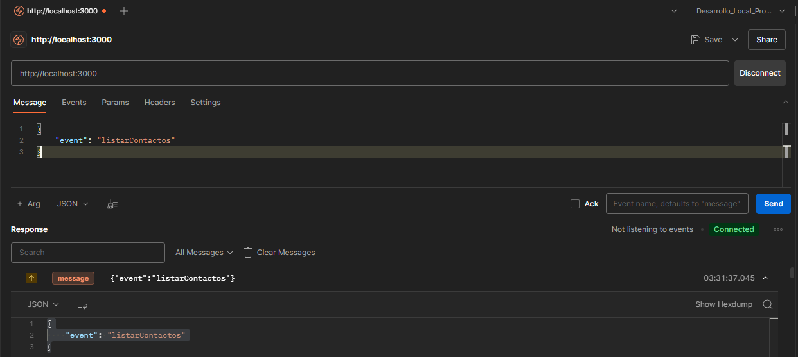
3. Actualizar datos del contacto
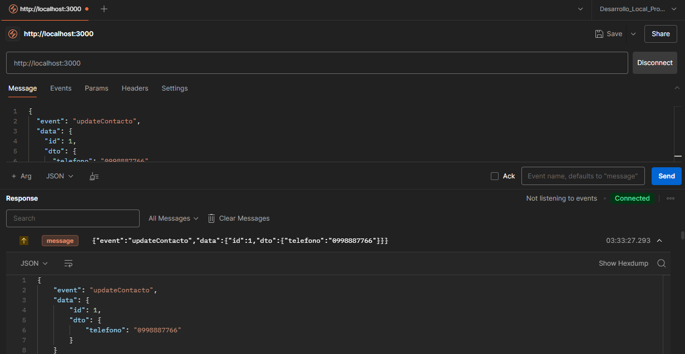
4. Eliminar contacto
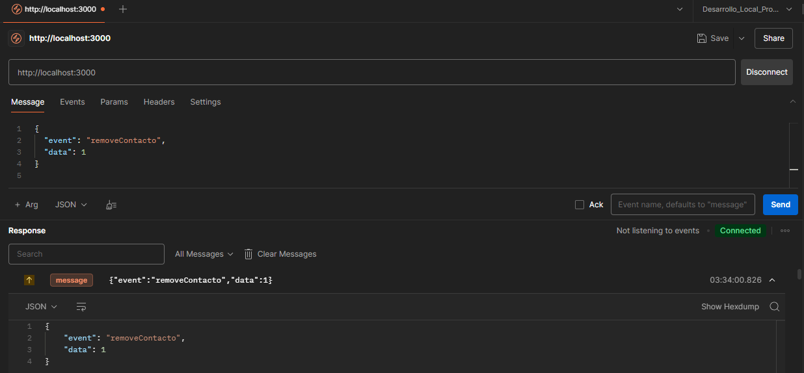